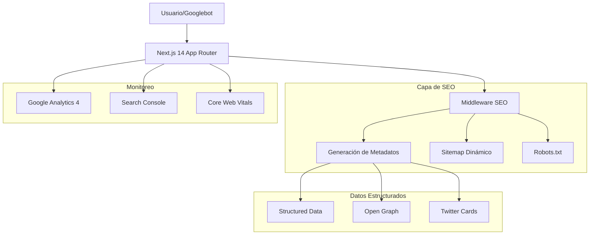
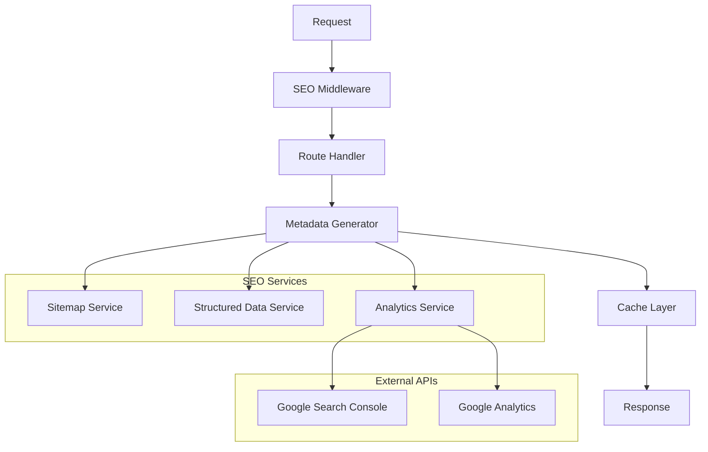
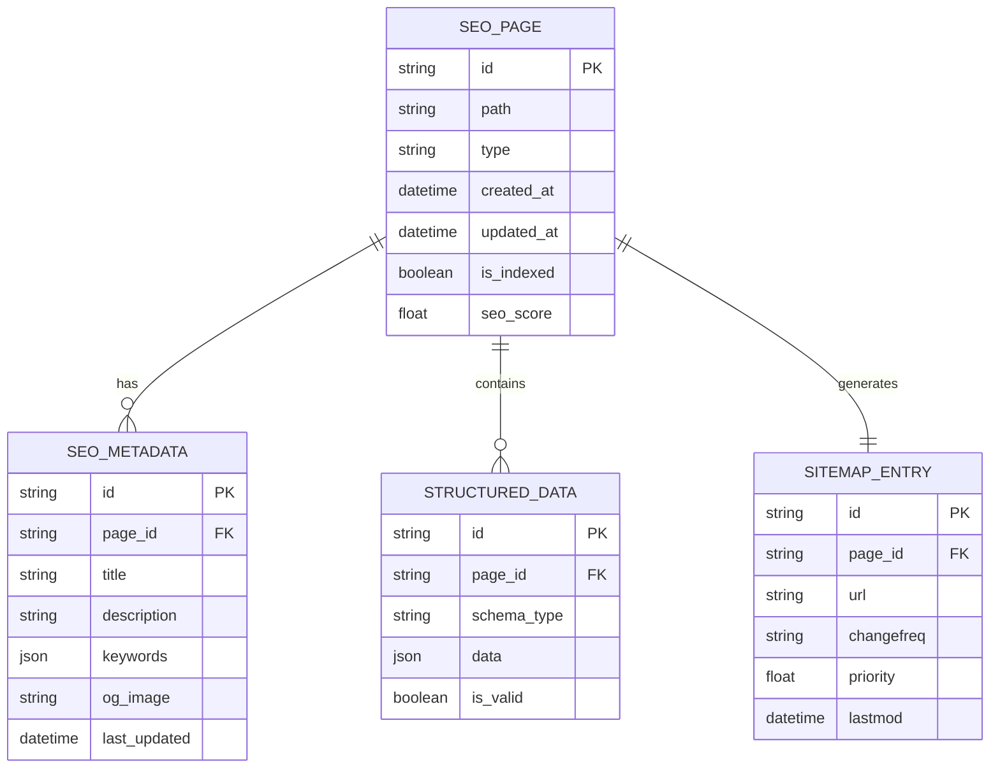

# Arquitectura Técnica SEO - TecnoCrypter

## 1. Arquitectura de SEO



## 2. Descripción de Tecnologías

- **Frontend**: Next.js 14 + App Router + TypeScript
- **SEO**: next-sitemap + structured data + metadatos dinámicos
- **Monitoreo**: Google Analytics 4 + Search Console API
- **Validación**: Lighthouse CI + custom SEO validators

## 3. Definiciones de Rutas SEO

| Ruta | Propósito SEO | Prioridad | Frecuencia |
|------|---------------|-----------|------------|
| / | Página principal, máxima autoridad | 1.0 | daily |
| /blog | Hub de contenido, alta frecuencia | 0.9 | daily |
| /blog/[slug] | Artículos individuales | 0.8 | weekly |
| /productos | Catálogo de productos | 0.9 | weekly |
| /productos/[id] | Páginas de productos específicos | 0.8 | monthly |
| /tools/* | Herramientas SEO, tráfico orgánico | 0.7 | weekly |
| /contacto | Página de contacto, conversión | 0.6 | monthly |
| /privacidad | Páginas legales requeridas | 0.5 | yearly |

## 4. APIs de SEO

### 4.1 API de Metadatos

**Generación de metadatos dinámicos**
```typescript
// GET /api/seo/metadata
```

Request:
| Parámetro | Tipo | Requerido | Descripción |
|-----------|------|-----------|-------------|
| path | string | true | Ruta de la página |
| type | string | false | Tipo de contenido (article, product, page) |

Response:
| Campo | Tipo | Descripción |
|-------|------|-------------|
| title | string | Título optimizado para SEO |
| description | string | Meta descripción |
| keywords | string[] | Palabras clave relevantes |
| structuredData | object | Datos estructurados JSON-LD |

Ejemplo:
```json
{
  "title": "Productos de Seguridad - TecnoCrypter",
  "description": "Descubre nuestra selección de productos de seguridad cibernética...",
  "keywords": ["ciberseguridad", "encriptación", "VPN"],
  "structuredData": {
    "@type": "Product",
    "name": "Secure VPN Pro"
  }
}
```

### 4.2 API de Sitemap

**Generación dinámica de sitemap**
```typescript
// GET /api/sitemap/generate
```

Request:
| Parámetro | Tipo | Requerido | Descripción |
|-----------|------|-----------|-------------|
| type | string | false | Tipo de sitemap (pages, blog, products) |
| lastmod | string | false | Fecha de última modificación |

Response:
| Campo | Tipo | Descripción |
|-------|------|-------------|
| urls | array | Lista de URLs con metadatos |
| count | number | Número total de URLs |
| lastGenerated | string | Timestamp de generación |

### 4.3 API de Validación SEO

**Validación de configuración SEO**
```typescript
// POST /api/seo/validate
```

Request:
| Parámetro | Tipo | Requerido | Descripción |
|-----------|------|-----------|-------------|
| url | string | true | URL a validar |
| checks | string[] | false | Tipos de validación a realizar |

Response:
| Campo | Tipo | Descripción |
|-------|------|-------------|
| isValid | boolean | Estado general de validación |
| errors | array | Lista de errores encontrados |
| warnings | array | Lista de advertencias |
| score | number | Puntuación SEO (0-100) |

## 5. Arquitectura del Servidor SEO



## 6. Modelo de Datos SEO

### 6.1 Definición del Modelo



### 6.2 Definición de Datos (DDL)

**Tabla de Páginas SEO**
```sql
-- Crear tabla de páginas SEO
CREATE TABLE seo_pages (
    id UUID PRIMARY KEY DEFAULT gen_random_uuid(),
    path VARCHAR(500) UNIQUE NOT NULL,
    type VARCHAR(50) NOT NULL CHECK (type IN ('page', 'article', 'product', 'tool')),
    created_at TIMESTAMP WITH TIME ZONE DEFAULT NOW(),
    updated_at TIMESTAMP WITH TIME ZONE DEFAULT NOW(),
    is_indexed BOOLEAN DEFAULT FALSE,
    seo_score DECIMAL(5,2) DEFAULT 0.00,
    last_crawled TIMESTAMP WITH TIME ZONE
);

-- Crear índices
CREATE INDEX idx_seo_pages_path ON seo_pages(path);
CREATE INDEX idx_seo_pages_type ON seo_pages(type);
CREATE INDEX idx_seo_pages_indexed ON seo_pages(is_indexed);
CREATE INDEX idx_seo_pages_score ON seo_pages(seo_score DESC);
```

**Tabla de Metadatos SEO**
```sql
-- Crear tabla de metadatos
CREATE TABLE seo_metadata (
    id UUID PRIMARY KEY DEFAULT gen_random_uuid(),
    page_id UUID REFERENCES seo_pages(id) ON DELETE CASCADE,
    title VARCHAR(60) NOT NULL,
    description VARCHAR(160) NOT NULL,
    keywords JSONB,
    og_image VARCHAR(500),
    canonical_url VARCHAR(500),
    last_updated TIMESTAMP WITH TIME ZONE DEFAULT NOW()
);

-- Crear índices
CREATE INDEX idx_seo_metadata_page_id ON seo_metadata(page_id);
CREATE INDEX idx_seo_metadata_title ON seo_metadata USING gin(to_tsvector('spanish', title));
CREATE INDEX idx_seo_metadata_keywords ON seo_metadata USING gin(keywords);
```

**Tabla de Datos Estructurados**
```sql
-- Crear tabla de structured data
CREATE TABLE structured_data (
    id UUID PRIMARY KEY DEFAULT gen_random_uuid(),
    page_id UUID REFERENCES seo_pages(id) ON DELETE CASCADE,
    schema_type VARCHAR(100) NOT NULL,
    data JSONB NOT NULL,
    is_valid BOOLEAN DEFAULT TRUE,
    created_at TIMESTAMP WITH TIME ZONE DEFAULT NOW()
);

-- Crear índices
CREATE INDEX idx_structured_data_page_id ON structured_data(page_id);
CREATE INDEX idx_structured_data_schema_type ON structured_data(schema_type);
CREATE INDEX idx_structured_data_valid ON structured_data(is_valid);
```

**Tabla de Entradas de Sitemap**
```sql
-- Crear tabla de sitemap
CREATE TABLE sitemap_entries (
    id UUID PRIMARY KEY DEFAULT gen_random_uuid(),
    page_id UUID REFERENCES seo_pages(id) ON DELETE CASCADE,
    url VARCHAR(500) NOT NULL,
    changefreq VARCHAR(20) DEFAULT 'weekly' CHECK (changefreq IN ('always', 'hourly', 'daily', 'weekly', 'monthly', 'yearly', 'never')),
    priority DECIMAL(2,1) DEFAULT 0.5 CHECK (priority >= 0.0 AND priority <= 1.0),
    lastmod TIMESTAMP WITH TIME ZONE DEFAULT NOW(),
    is_active BOOLEAN DEFAULT TRUE
);

-- Crear índices
CREATE INDEX idx_sitemap_entries_page_id ON sitemap_entries(page_id);
CREATE INDEX idx_sitemap_entries_url ON sitemap_entries(url);
CREATE INDEX idx_sitemap_entries_active ON sitemap_entries(is_active);
CREATE INDEX idx_sitemap_entries_lastmod ON sitemap_entries(lastmod DESC);
```

**Datos Iniciales**
```sql
-- Insertar páginas principales
INSERT INTO seo_pages (path, type, is_indexed, seo_score) VALUES
('/', 'page', TRUE, 95.0),
('/blog', 'page', TRUE, 90.0),
('/productos', 'page', TRUE, 88.0),
('/contacto', 'page', TRUE, 75.0),
('/tools/verificador', 'tool', FALSE, 70.0),
('/tools/generador-contrasenas', 'tool', FALSE, 70.0),
('/tools/limpia-metadatos', 'tool', FALSE, 70.0);

-- Insertar metadatos base
INSERT INTO seo_metadata (page_id, title, description, keywords) 
SELECT 
    id,
    CASE 
        WHEN path = '/' THEN 'TecnoCrypter - Ciberseguridad y Criptomonedas'
        WHEN path = '/blog' THEN 'Blog de Ciberseguridad | TecnoCrypter'
        WHEN path = '/productos' THEN 'Productos de Seguridad | TecnoCrypter'
        WHEN path = '/contacto' THEN 'Contacto | TecnoCrypter'
        ELSE 'TecnoCrypter'
    END,
    CASE 
        WHEN path = '/' THEN 'Plataforma líder en ciberseguridad, encriptación y tecnología blockchain. Productos seguros y herramientas de privacidad.'
        WHEN path = '/blog' THEN 'Últimas noticias, análisis y tendencias en ciberseguridad, blockchain y criptomonedas.'
        WHEN path = '/productos' THEN 'Productos de ciberseguridad y encriptación de última generación con pago en criptomonedas.'
        WHEN path = '/contacto' THEN 'Ponte en contacto con nuestro equipo de expertos en ciberseguridad.'
        ELSE 'Herramientas gratuitas de ciberseguridad y privacidad online.'
    END,
    CASE 
        WHEN path = '/' THEN '["ciberseguridad", "encriptación", "criptomonedas", "blockchain"]'
        WHEN path = '/blog' THEN '["blog", "noticias", "ciberseguridad", "análisis"]'
        WHEN path = '/productos' THEN '["productos", "seguridad", "VPN", "gestores contraseñas"]'
        WHEN path = '/contacto' THEN '["contacto", "soporte", "consultoría"]'
        ELSE '["herramientas", "utilidades", "seguridad", "online"]'
    END::jsonb
FROM seo_pages;

-- Insertar entradas de sitemap
INSERT INTO sitemap_entries (page_id, url, changefreq, priority)
SELECT 
    id,
    'https://tecnocrypter.com' || path,
    CASE 
        WHEN path = '/' THEN 'daily'
        WHEN path LIKE '/blog%' THEN 'daily'
        WHEN path = '/productos' THEN 'weekly'
        ELSE 'weekly'
    END,
    CASE 
        WHEN path = '/' THEN 1.0
        WHEN path = '/blog' THEN 0.9
        WHEN path = '/productos' THEN 0.9
        WHEN path LIKE '/tools/%' THEN 0.7
        ELSE 0.6
    END
FROM seo_pages;
```

## 7. Configuración de Permisos

```sql
-- Permisos para rol anónimo (lectura de sitemap público)
GRANT SELECT ON sitemap_entries TO anon;
GRANT SELECT ON seo_pages TO anon;

-- Permisos para rol autenticado (acceso completo)
GRANT ALL PRIVILEGES ON seo_pages TO authenticated;
GRANT ALL PRIVILEGES ON seo_metadata TO authenticated;
GRANT ALL PRIVILEGES ON structured_data TO authenticated;
GRANT ALL PRIVILEGES ON sitemap_entries TO authenticated;
```

## 8. Funciones de Utilidad

```sql
-- Función para actualizar score SEO
CREATE OR REPLACE FUNCTION update_seo_score(page_path VARCHAR)
RETURNS DECIMAL AS $$
DECLARE
    score DECIMAL := 0;
    metadata_score DECIMAL := 0;
    structured_data_score DECIMAL := 0;
BEGIN
    -- Calcular score basado en metadatos
    SELECT 
        CASE 
            WHEN LENGTH(title) BETWEEN 30 AND 60 THEN 25
            WHEN LENGTH(title) BETWEEN 20 AND 70 THEN 15
            ELSE 5
        END +
        CASE 
            WHEN LENGTH(description) BETWEEN 120 AND 160 THEN 25
            WHEN LENGTH(description) BETWEEN 100 AND 180 THEN 15
            ELSE 5
        END +
        CASE 
            WHEN jsonb_array_length(keywords) BETWEEN 3 AND 8 THEN 20
            WHEN jsonb_array_length(keywords) BETWEEN 1 AND 10 THEN 10
            ELSE 0
        END
    INTO metadata_score
    FROM seo_metadata sm
    JOIN seo_pages sp ON sm.page_id = sp.id
    WHERE sp.path = page_path;
    
    -- Calcular score de structured data
    SELECT COUNT(*) * 10
    INTO structured_data_score
    FROM structured_data sd
    JOIN seo_pages sp ON sd.page_id = sp.id
    WHERE sp.path = page_path AND sd.is_valid = TRUE;
    
    score := LEAST(100, metadata_score + structured_data_score + 30); -- 30 puntos base
    
    -- Actualizar score en la tabla
    UPDATE seo_pages 
    SET seo_score = score, updated_at = NOW()
    WHERE path = page_path;
    
    RETURN score;
END;
$$ LANGUAGE plpgsql;

-- Función para generar sitemap XML
CREATE OR REPLACE FUNCTION generate_sitemap_xml()
RETURNS TEXT AS $$
DECLARE
    xml_content TEXT := '<?xml version="1.0" encoding="UTF-8"?>';
    url_entry RECORD;
BEGIN
    xml_content := xml_content || '<urlset xmlns="http://www.sitemaps.org/schemas/sitemap/0.9">';
    
    FOR url_entry IN 
        SELECT url, lastmod, changefreq, priority
        FROM sitemap_entries 
        WHERE is_active = TRUE
        ORDER BY priority DESC, lastmod DESC
    LOOP
        xml_content := xml_content || 
            '<url>' ||
            '<loc>' || url_entry.url || '</loc>' ||
            '<lastmod>' || to_char(url_entry.lastmod, 'YYYY-MM-DD"T"HH24:MI:SS"Z"') || '</lastmod>' ||
            '<changefreq>' || url_entry.changefreq || '</changefreq>' ||
            '<priority>' || url_entry.priority || '</priority>' ||
            '</url>';
    END LOOP;
    
    xml_content := xml_content || '</urlset>';
    
    RETURN xml_content;
END;
$$ LANGUAGE plpgsql;
```